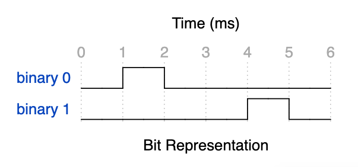
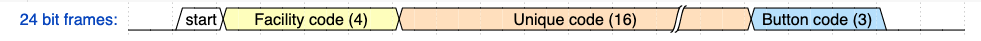

# Linear Megacode Protocol.

## Carrier and Timing

The remotes are supposed to transmit at 318.0 MHz [OOK](https://en.wikipedia.org/wiki/On%E2%80%93off_keying), though I've seen the MCT-11 stray significantly off frequency to the point a Linear Receiver cannot even receive the transmission.  The MCT-11 has a potentiometer you can change on the board but I've found it falls out of calibration within a month.  Remotes such as the ACT-31B and ACT-34B seem to be much more frequency stable.

A Linear Megacode transmission consists of 24 bit frames starting with the most significant bit and ending with the least.  Each of the 24 bit frames is 6 milliseconds wide and always contains a single 1 millisecond pulse.  A frame with more than 1 pulse or a frame with no pulse is invalid and a receiver should reset and begin watching for another start bit.

The position of the pulse within the bit frame determines if it represents a binary 0 or binary 1.  If the pulse is within the first half of the frame, it represents binary 0.  The second half of the frame represents a binary 1.

Since each bit contains a pulse, the protocol is self clocking since the time can be measured from when the most recent bit frame was decoded.  This is particularly important since most of the remotes I have seen have varied in their clock rates by up to 15%.  My first decoding approach failed because I decoded the time delta since the very first bit and my decoder would often drift 2-3 bit frames before decoding the last bit frame.

The 24 bits does not change.  The code is always the same every time the remote is pressed.  There does not appear to be any [Rolling Code](https://en.wikipedia.org/wiki/Rolling_code) support in this protocol. 

[Preivous work here](https://git.cuvoodoo.info/megacode/about/) typically records the 24 bits as 6 hex digits.  My program also shows this for compatability.

## Decoding the bits

The first bit (the start bit) is always a binary 1, followed by a 4-bit __Facility Code__, a unique 16-bit __Unique Remote Code__, and a 3-bit __Button Code__.

## Facility Codes, Remote Codes, and Button Codes

### Facility Codes

Remotes are programmed with a 4-bit facility code that ranges from 1 to 
15.  I've never seen 0 used on a transmitter, though often 0 is used on 
receivers to mean match any facility code number.

### Unique Remote Code
Remotes that are sold individually typically have a 16-bit unique 
code printed in decimal on a sticky label.  The label is 
important in that many receivers require the number for programming from 
a touch-tone keypad.

With 16 bits, in theory his yields values in theory from 1 to 65535.  
Values less than 10000 will have a leading 0.  I've never seen a value 
less than 1000.

Bulk packages of transmitters are often sold in blocks of 100 and have a 
start range and end range of codes.  Each remote has a number one higher 
than the previous in the pack.  They typically also share the same 
Facility code.  This allows convenient _Block Programming_ on the 
receiver.

I've heard of resellers breaking these packs up and selling them 
indivually though typically they don't have the sticker on the back of 
each remote with the code necessary for programming most systems that 
require the number.  However they can work with Linear Garage Door Openers that 
have a _Learn Button_ even if you don't know the code.

For the record, I mainly made this project so I could figure out what the code 
when presented with a remote without a label.

## Button Codes

With 3 bits in theory 8 buttons are possible.  Single button remotes 
always send a value of 2.  Here are common button numbers I've seen:

- 1 - Top left button on ACT34-B
- 2 - Default or Large button on most remotes
- 5 - Round red lower right button on ACT34-B
- 6 - Round grey lower left button on ACT34-B

Some receivers can be programmed to have different buttons operate 
different relays by system policy.

## Further Reading
* [ACT-34B Remote Manual](https://www.nortekcontrol.com/wp-content/uploads/ACT-31B_ACT-34B.pdf)
* [ACT-34B FCC Report](https://fcc.report/FCC-ID/EF4ACP00872)
* [AE-500 Installation Instructions](https://www.nortekcontrol.com/wp-content/uploads/AE-500.pdf)
* [Megacode Gate Radio Control Receiver Reverse Engineering](https://www.cuvoodoo.info/cuvoodoo-005-megacode-gate-radio-control-receiver-reverse-engineering/)
* [CCC lecture: MegaCode to facility gates](https://fahrplan.events.ccc.de/congress/2014/Fahrplan/events/6462.html)
* [CuVoodoo Wiki](https://wiki.cuvoodoo.info/doku.php?id=megacode)
